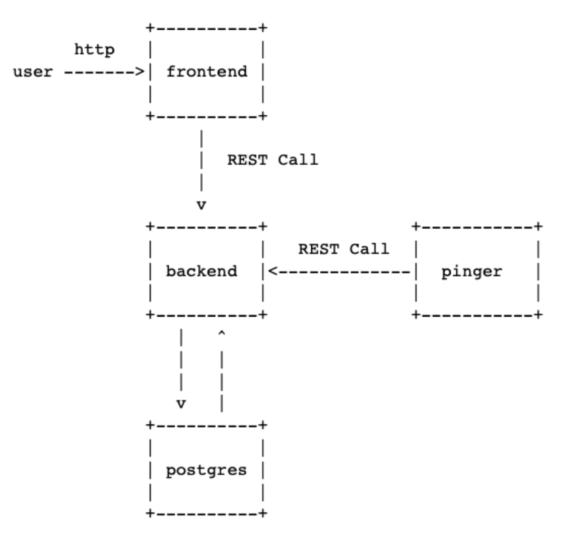

#### Общая информация

*Backend* сервис обеспечивает RESTful API для запроса данных из DB и добавления туда новых данных.

*Frontend* сервис написан на JS с использованием React. Берет данные через API Backend и отображает данные по всем IP-адресам в виде таблицы: IP-адрес, время пинга, дата последней успешной попытки.

*PostgreSQL* база данных, хранит информацию о проверке состояния контейнеров.

*Pinger* Получает список всех Docker-контейнеров, пингует их и отправляет данные в базу через API Frontend.

##### Схема проекта

Контейнеры собираются и оркестрируются с помощью docker-compose

##### Запуск
Для запуска приложения используйте команду make, находясь в корневой директории. Она запустит инструкции из docker-compose-файла. 

